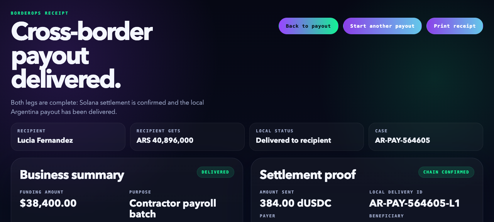

# Solana-CrossBorder-Transaction-Devnet-Demo



Solana-CrossBorder-Transaction-Devnet-Demo is a Solana devnet demo for cross-border payout operations.
It models one real workflow: a US company releases a contractor payout, funds a signer wallet with demo stablecoins, settles the on-chain leg, then tracks the local payout handoff until delivery.

## What is real

- browser-based demo wallet flow
- demo stablecoin mint on Solana devnet
- real devnet funding and token transfer
- receipt with transaction signature and explorer link
- SQLite-backed payout case, funding event, and receipt state

## What is still mocked

- FX quote generation
- local payout partner response
- compliance / approval policy logic
- beneficiary onboarding and payout intake

## Repo structure

- `apps/web` – React/Vite operator UI
- `services/quote-engine` – local API for quotes, SQLite persistence, and devnet funding helpers
- `docs` – product notes and architecture
- `programs/escrow_router` – placeholder for future on-chain approval logic

## Run locally

```bash
pnpm install
cp apps/web/.env.example apps/web/.env.local
cp services/quote-engine/.env.example services/quote-engine/.env
pnpm dev:api
pnpm dev:web -- --host 127.0.0.1 --port 4174
```

Then open [http://127.0.0.1:4174/](http://127.0.0.1:4174/).

## Demo flow

1. Create a demo wallet.
2. Fund it with `dUSDC` and fee SOL.
3. Approve the payout on devnet.
4. Review the receipt.
5. Mark the local payout as delivered.
6. Start another payout from the completed case.

## Current limits

This is not production money infrastructure.
There is no real custody separation, no production auth, no real payout partner integration, and no on-chain approval program yet.
